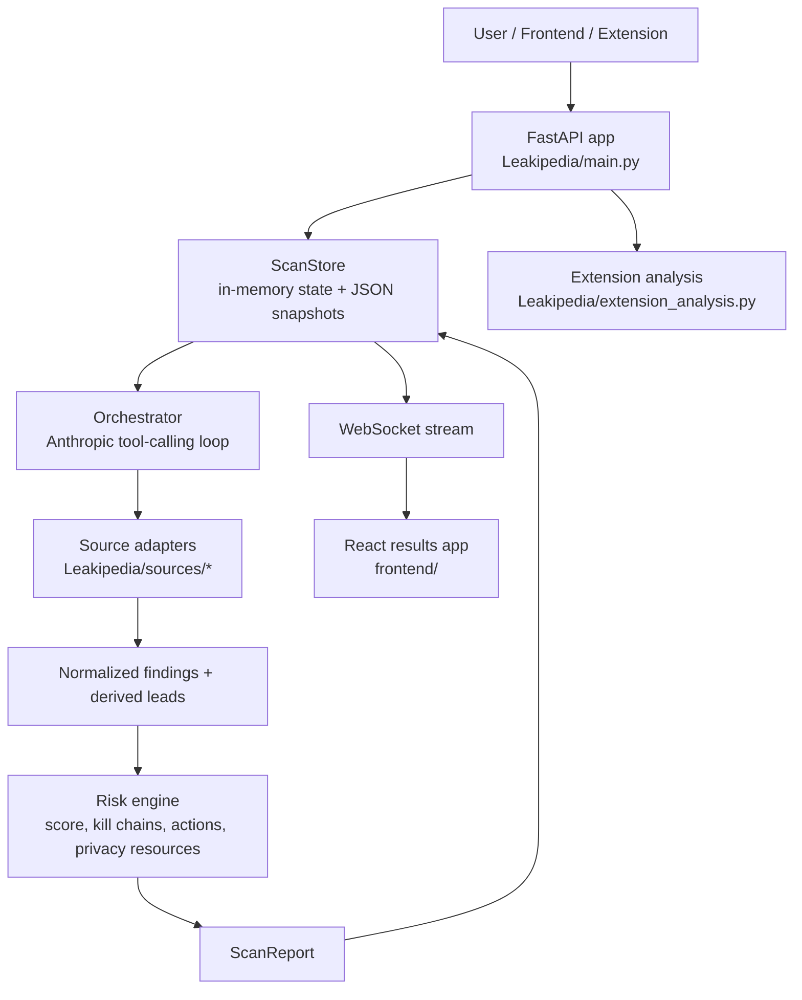

# Leakipedia

Leakipedia is a multi-source digital exposure scanner built for Empire Hacks 2026. It combines a FastAPI backend, an LLM-guided scan orchestrator, a deterministic risk engine, a React results dashboard, and a Chrome extension that warns users before they submit sensitive data on risky sites.

The repository name is `empire-hackathon`, but the product implemented inside it is `Leakipedia`.

## What the project does

- Scans a person's public digital footprint starting from a name plus at least one identifier such as email, username, or phone.
- Uses multiple OSINT-style sources to find breaches, account registrations, broker listings, archived pages, metadata leaks, and related leads.
- Streams scan progress live to a results UI over WebSockets.
- Produces a structured report with findings, lead provenance, deterministic exposure scoring, attack-path summaries, and remediation actions.
- Ships a browser extension (`Leak Prevent`) that analyzes the current page for privacy risk, warns on sensitive fields, and can hand off a flagged page into the dashboard.

## Architecture Overview



### Main runtime components

| Component | Responsibility |
| --- | --- |
| `Leakipedia/main.py` | FastAPI app, HTTP routes, WebSocket streaming, static asset serving, extension install/package endpoints |
| `Leakipedia/agent/orchestrator.py` | Multi-round agent loop, Anthropic tool-calling, source execution, lead promotion, audit logging |
| `Leakipedia/agent/scan_store.py` | Active scan state, event fan-out, completed report snapshots |
| `Leakipedia/agent/schemas.py` | Core Pydantic models for requests, findings, leads, score breakdowns, and reports |
| `Leakipedia/sources/*.py` | Source adapter layer; each adapter exposes a tool schema plus a normalized `scan()` implementation |
| `Leakipedia/risk/*.py` | Deterministic scoring, kill chain generation, action generation, state-law/resource catalogs, provenance annotations |
| `Leakipedia/extension_analysis.py` | Site classification, tracker detection, dark-pattern heuristics, focused-field sensitivity analysis |
| `frontend/` | React + Vite results application served at `/results` |
| `browser_extension/leak-prevent/` | Chrome Manifest V3 extension for page analysis, warnings, and rescue handoff |
| `app.py` | ASGI entrypoint used by deployment platforms such as Vercel |

## Scan Lifecycle

### 1. Request intake

The backend accepts a `ScanRequest` with:

- `full_name`
- at least one of `email`, `username`, or `phone`
- optional `location`
- optional future-facing flags such as `use_emailrep`, `use_breachdirectory`, and `use_intelx`

`POST /scan` creates a `ScanState`, publishes a `scan_started` event, and either:

- runs synchronously when `LEAKIPEDIA_SYNC_SCAN=1` or on Vercel
- runs in the background with `asyncio.create_task()` in local/server mode

### 2. Lead seeding

The orchestrator seeds an initial lead registry from confirmed user inputs and conservative username permutations generated from the target's full name. Each lead is tracked with:

- type
- value
- confidence
- origin
- search status (`confirmed`, `auto_search`, `deferred`, `promoted`, `searched`, etc.)
- supporting findings/sources

This lead registry is the main mechanism that keeps the scan from repeatedly searching weak or already-visited identifiers.

### 3. LLM-guided search rounds

`Leakipedia/agent/orchestrator.py` registers every available source adapter as an Anthropic tool. For each round, Claude:

- inspects the current findings and lead registry
- emits a visible trace plan for the audit log
- selects source tools to call
- passes tool inputs such as email, username, phone, name, domain, or URL

The backend then executes tool calls in parallel with `asyncio.gather()`.

### 4. Source execution and normalization

Each source adapter inherits from `BaseSource` and provides:

- `tool_definition()`
- `scan(input_type, input_value)`
- `is_available()`

Adapters normalize their output into shared `Finding` objects with:

- `source`
- `source_url`
- `finding_type`
- `confidence`
- `severity`
- `data`
- `leads_to`

New leads extracted from a finding are registered back into the lead registry and can be promoted from deferred to searchable if evidence improves.

### 5. Live progress streaming

The backend publishes events such as:

- `scan_started`
- `round_start`
- `tool_call`
- `tool_result`
- `finding`
- `audit_step`
- `round_complete`
- `risk_assessment`
- `scan_complete`

The React results app subscribes to `WS /scan/{scan_id}/stream` and falls back to polling/report hydration if needed.

### 6. Risk scoring and report generation

After the scan rounds finish, the system builds a `ScanReport` with:

- all findings
- the full lead registry
- a deterministic exposure score
- score factor breakdowns
- kill chains
- remediation actions
- applicable laws
- privacy resources
- decision summary
- safety boundaries
- audit trail

The numeric score is not LLM-generated. It comes from `Leakipedia/risk/scorer.py`, which scores:

- exposed data inventory
- attack surfaces unlocked by data combinations
- accessibility/discoverability of the exposed data

Claude is used only for some narrative synthesis on top of the deterministic core.

### 7. Persistence

Completed reports are written as JSON snapshots:

- locally to `Leakipedia/dev_saved_scans/`
- on Vercel to `/tmp/leakipedia_saved_scans`

Active scan state is still in memory.

## API Surface

### Core scan endpoints

- `GET /health`
- `POST /scan`
- `GET /scan/{scan_id}`
- `GET /scan/{scan_id}/audit-trail`
- `GET /scan/{scan_id}/actions`
- `WS /scan/{scan_id}/stream`

### Results and static assets

- `GET /`
- `GET /results`
- `GET /static/*`

### Browser extension endpoints

- `GET /extension/install`
- `GET /extension/package`
- `POST /extension/analyze`
- `POST /extension/rescue-lead`
- `GET /rescue/{lead_id}`

## Source Integrations

The project already has an adapter pattern for multiple classes of sources. Availability depends on API keys and whether optional CLI tools are installed.

### Account and breach discovery

- `HIBPSource`
- `HaveIBeenSoldSource`
- `PwnedPasswordsSource`
- `LeakCheckSource`
- `HoleheScanSource`
- `HunterSource`

### Username, profile, and web discovery

- `MaigretScanSource`
- `SherlockScanSource`
- `GitHubSearchSource`
- `GravatarSource`
- `DuckDuckGoSearchSource`
- `GoogleSearchSource`
- `WaybackSource`
- `CrtshSource`
- `WhoisSource`

### Phone, document, and metadata discovery

- `PhoneInfogaScanSource`
- `NumVerifySource`
- `ExifToolScanSource`

### Data broker and paste-style discovery

- `DataBrokersSource`
- `PasteSearchSource`

### Important implementation note

The request model already includes flags for `use_emailrep`, `use_breachdirectory`, and `use_intelx`, but those integrations are not fully wired through the current source registry and UI flow yet. That is a real backlog item, not completed functionality.

## Browser Extension Architecture

The Chrome extension under `browser_extension/leak-prevent/` is a separate client that talks to the FastAPI backend.

### Extension flow

1. `content.js` inspects the page for forms, trackers, privacy policy signals, and dark-pattern cues.
2. On page load and focused-field changes, it sends an `ANALYZE_PAGE` message to `background.js`.
3. `background.js` forwards the snapshot to `POST /extension/analyze`.
4. `Leakipedia/extension_analysis.py` classifies the site, scores risk, and optionally analyzes the focused field.
5. The extension displays a warning overlay, suggests a masked email alias for supported providers, and stores local logs.
6. If the user saves a rescue lead, the extension posts to `POST /extension/rescue-lead` and opens `/rescue/{lead_id}`.

### What the extension currently detects

- sensitive form fields
- third-party trackers
- privacy policy presence
- common dark patterns
- likely data broker sites
- sketchy/newly registered domains
- social/job application context
- Global Privacy Control context where relevant

## Frontend Architecture

The modern results experience lives in `frontend/` and is served from `/results`.

### Key frontend behavior

- React 18 + Vite + TypeScript
- live WebSocket connection to scan events
- reducer-based state updates in `frontend/src/ResultsApp.tsx`
- report caching via `frontend/src/reportCache.ts`
- dedicated components for findings, trace rounds, live workspace, summary, and utility overlays

### Build and serving model

- local dev uses the Vite dev server
- Vite proxies `/scan`, `/static`, and `/extension` back to FastAPI
- production build outputs to `Leakipedia/static/results-app/`
- FastAPI serves the bundle from `/results`
- if the bundle is missing, the backend falls back to the legacy static results page

## Repository Layout

```text
.
|-- app.py
|-- Leakipedia/
|   |-- agent/
|   |-- risk/
|   |-- sources/
|   |-- static/
|   |-- extension_analysis.py
|   |-- config.py
|   `-- main.py
|-- frontend/
`-- browser_extension/leak-prevent/
```

## Local Development

### Prerequisites

- Python 3.9+
- Node.js 18+ and npm
- Anthropic API key for the agent workflow
- optional CLI tools for richer scans: `maigret`, `holehe`, `sherlock`, `phoneinfoga`, `exiftool`

### Backend setup

```bash
python3 -m venv .venv
source .venv/bin/activate
pip install -r requirements.txt
```

Create a `.env` file in the project root. At minimum:

```env
ANTHROPIC_API_KEY=...
CLAUDE_MODEL=claude-sonnet-4-20250514
```

Optional keys currently supported by the code:

```env
HIBP_API_KEY=
GOOGLE_CSE_API_KEY=
GOOGLE_CSE_CX=
HUNTER_API_KEY=
NUMVERIFY_API_KEY=
GITHUB_TOKEN=
BREACHDIRECTORY_RAPIDAPI_KEY=
INTELX_API_KEY=
LEAKIPEDIA_SYNC_SCAN=
LEAKIPEDIA_SNAPSHOT_DIR=
```

Start the backend:

```bash
python -m uvicorn Leakipedia.main:app --reload
```

### Results frontend setup

```bash
cd frontend
npm install
npm run dev
```

The dev server runs on `http://127.0.0.1:5173` and proxies backend routes to `http://127.0.0.1:8000`.

### Browser extension setup

1. Open `chrome://extensions`
2. Enable Developer Mode
3. Click `Load unpacked`
4. Select `browser_extension/leak-prevent/`
5. In extension settings, point `dashboardUrl` at your local backend if needed

## Deployment Notes

This repo is already set up for Vercel-style deployment:

- `app.py` exposes the ASGI app entrypoint
- `vercel.json` builds the React frontend before serving FastAPI
- on Vercel, scans run synchronously because background in-process tasks are not reliable across serverless invocations

Current deployment implications:

- completed scan snapshots survive only within the configured snapshot directory
- active in-progress scans are not durable across process restarts
- the in-memory rescue lead store is also ephemeral

## Current Limitations

- The main scan state store is in-memory, with persistence only for completed reports.
- The rescue lead handoff from the extension is also in-memory.
- Some integrations are optional and environment-dependent because they need external API keys or installed CLI tools.
- The request schema contains feature flags for future integrations that are not fully implemented yet.
- The orchestrator has a bounded search loop; it is better than one-shot lookup, but it is not yet a truly exhaustive search engine.
- There is no full authentication, quota, rate-limit, or multi-user persistence layer yet.
- The current prompt says to execute exactly 3 rounds, while config allows up to 5 rounds. That should be harmonized.

## Next Steps

### 1. Better exhaustive search

- Replace the fixed round loop with a frontier-based search scheduler that prioritizes leads by confidence, novelty, source cost, and risk value.
- Build a stronger canonical entity graph so email, username, phone, domain, and profile URL evidence can be merged instead of treated as loosely related strings.
- Improve deduplication and normalization across sources so repeated hits reinforce confidence without inflating noise.
- Add search budgeting controls per source and per scan so the system can explore deeper while staying within rate limits and time budgets.
- Persist the lead graph and source results so scans can resume, compare deltas, and continue from prior evidence instead of starting from scratch.
- Separate "breadth mode" and "depth mode" search strategies to support both quick scans and high-effort investigations.

### 2. Further integrations

- Wire the existing request flags for EmailRep, BreachDirectory, and IntelX into real adapters, settings, and frontend controls.
- Add more source categories such as stronger people-search, image/profile correlation, and additional breach/broker feeds.
- Expand broker-removal support from "show opt-out URL" to "track opt-out status and follow-up actions".
- Add richer GitHub, paste, archive, and search-engine correlation so discovered leads feed better into the recursive search loop.

### 3. Production hardening

- Move from in-memory scan state to a persistent database plus a queue/worker model.
- Add authentication, user ownership of scans, and secure access to saved reports.
- Add rate limiting, retries, caching, structured telemetry, and better failure visibility per source.
- Add automated tests around source adapters, lead promotion, scoring, and API contracts.
- Tighten deployment security around secrets, CORS, and extension/backend trust boundaries.

### 4. Product and reporting improvements

- Add scan history, report diffing, and trend tracking over time.
- Export reports as PDF/shareable links.
- Let users confirm or reject ambiguous leads during a scan.
- Connect extension history with dashboard identity profiles so page-level privacy events enrich long-term exposure tracking.

## Work Done So Far

### Backend and agent system

- Built a FastAPI backend with scan creation, report retrieval, audit trail access, WebSocket streaming, and extension-specific endpoints.
- Implemented a multi-round Anthropic tool-calling orchestrator with lead seeding, finding normalization, lead derivation, lead promotion, and audit logging.
- Added a common source adapter interface and a registry-based way to expose sources as tools.
- Added JSON snapshot persistence for completed reports.

### Analysis and scoring

- Implemented normalized `Finding`, `Lead`, `ScoreBreakdown`, and `ScanReport` models.
- Added deterministic exposure scoring based on exposed data types, attack surfaces, and data accessibility.
- Added template/fallback kill chain generation and remediation action generation.
- Added state/privacy-law routing and privacy-resource recommendations.

### Frontend

- Built a dedicated React + Vite results app for `/results`.
- Added live progress rendering for scan events, findings, audit rounds, and final report sections.
- Added client-side report hydration/cache behavior so completed scans can be revisited.
- Kept compatibility with a legacy static results page as a fallback.

### Browser extension

- Built a Manifest V3 Chrome extension with content, background, popup, side panel, and options flows.
- Added page snapshotting for forms, trackers, privacy policies, and dark-pattern signals.
- Added backend-powered page classification and field sensitivity warnings.
- Added masked-email suggestions for supported inbox providers.
- Added rescue lead handoff from the extension back into the dashboard.

### Deployment baseline

- Added an ASGI deployment entrypoint in `app.py`.
- Added a Vercel build configuration that compiles the frontend and serves the backend.
- Added synchronous scan fallback behavior for serverless environments.

## Suggested Near-Term Priorities

If this project is being continued after the hackathon, the highest-value sequence is:

1. Persist scan state and lead graphs in a real database.
2. Finish wiring the unfinished integrations already implied by the request schema.
3. Upgrade the recursive search loop into a budgeted frontier search.
4. Add tests around scoring, lead promotion, and source normalization.
5. Add user accounts and scan history.
